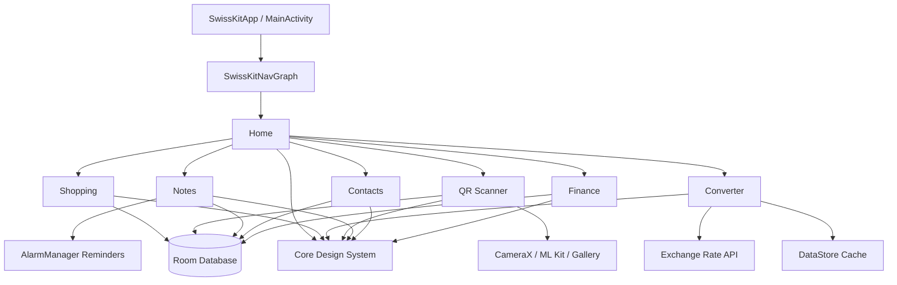
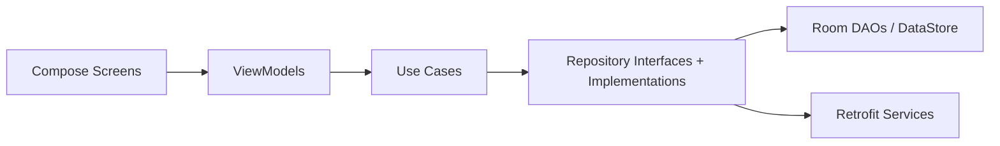

# SwissKit Android

SwissKit is a modular Android utility app built with Kotlin, Jetpack Compose, and Material 3. It combines multiple everyday tools in a single codebase while keeping feature boundaries explicit and testable.

## Table of Contents
- [Project Overview](#project-overview)
- [Tech Stack](#tech-stack)
- [Architecture Overview](#architecture-overview)
- [Module Breakdown](#module-breakdown)
- [Screenshots](#screenshots)
- [Getting Started](#getting-started)
- [Build & Run](#build--run)
- [Testing](#testing)
- [Project Structure](#project-structure)
- [Roadmap / Next Version](#roadmap--next-version)

## Project Overview
- Platform: Android app using a single Gradle module (`:app`).
- UI architecture: Jetpack Compose screens organized by feature module.
- State management: `StateFlow<UiState>` exposed by ViewModels, collected by Compose screens.
- Data strategy: local-first persistence with Room entities and repositories; DataStore for lightweight preference and cache storage.
- Composition root: Hilt wires dependency injection across all features via `@InstallIn(SingletonComponent::class)` modules.

## Tech Stack
- Language: Kotlin 2.0.21
- UI: Jetpack Compose (Compose BOM 2025.05.00) + Material 3
- Dependency Injection: Hilt 2.51.1
- Navigation: Navigation Compose 2.8.5
- Persistence: Room 2.7.1 (schema version 6) + DataStore Preferences 1.1.2
- Networking: Retrofit 2.11.0 + OkHttp 4.12.0 + Kotlinx Serialization 1.7.3
- Camera / scanning: CameraX 1.4.2 + ML Kit Barcode Scanning 17.3.0
- QR generation: ZXing Core 3.5.3
- Logging: Timber 5.0.1 (wrapped by `SwissKitLogger`)
- Testing: JUnit 4, MockK 1.13.12, Turbine 1.2.0, kotlinx-coroutines-test 1.9.0

## Architecture Overview
SwissKit follows Clean Architecture + MVVM with explicit repository interfaces, keeping UI and persistence loosely coupled.

### High-Level Module Diagram


### Data Flow / Layer Diagram


### Architectural Notes
- Every feature follows the same layer structure: `presentation/`, `domain/`, `data/`, `di/`.
- ViewModels are `@HiltViewModel` classes that expose `StateFlow<UiState>` and handle one-shot events.
- Use cases each encapsulate a single business operation and return `SwissKitResult<T>` (`Success`/`Error`).
- Repository interfaces live in `domain/`; implementations live in `data/` and are bound via Hilt modules.
- Entity-to-domain mapping is handled by dedicated mapper files inside `data/mapper/`.
- `SwissKitLogger` wraps Timber with module-tagged logging methods (`d`, `i`, `w`, `e`).

## Module Breakdown

### Home
- Entry dashboard and navigation hub.
- Displays available tools in a scrollable catalog and routes to each feature screen.
- Tool catalog is defined as a typed model (`ToolCatalog`) with unit test coverage.

### Finance
- Tracks income and expense records with category, notes, and date.
- Supports filtering by type/category, sorting (ascending/descending), multi-select, and bulk delete.
- Includes local backup import/export (JSON) and PDF report generation.
- Persists `FinanceEntity` records through `FinanceRepository` backed by Room.

### Contacts
- Manages contact categories and individual contacts as nested data.
- Supports CRUD for both categories and contacts, inline search, and quick actions (call / WhatsApp).
- Splits concerns using `CategoryRepository` and `ContactRepository`.

### Notes
- Creates and edits notes with lightweight markdown rendering.
- Supports note search and one-line previews.
- Provides local reminders via `AlarmManager` (`setExactAndAllowWhileIdle`) with recurring recurrence support.
- `ReminderBootReceiver` restores scheduled reminders after device reboot.

### QR Scanner
- Provides two modes: scan and generate.
- Scan mode uses CameraX for live preview and ML Kit for real-time barcode detection.
- Detects content type (URL, contact, email, phone, location, text, etc.) via `QRContentType`.
- Stores scan history in Room via `QRScanRepository`; supports label editing.
- Generator mode creates QR images with ZXing and supports saving to gallery.

### Converter
- Contains two tools:
  - Unit conversion (length, weight, volume, temperature) using typed `UnitCategory` models.
  - Currency conversion with remote rates and offline-first cache fallback.
- Currency pipeline:
  - `CurrencyConverterViewModel` → `GetLatestRatesUseCase` → `RatesRepository`.
  - `ExchangeRateApiService` (Retrofit) fetches latest rates.
  - DataStore-backed `RatesLocalDataSource` caches rates with a 30-minute TTL (`CACHE_TTL_MS = 30 * 60 * 1_000L`).
  - Stale rates are served as a fallback when the device is offline.
- User's last selected currency pair is persisted via DataStore.

### Shopping
- Manages shopping items with checked/unchecked state.
- Supports add, edit, delete, toggle, duplicate prevention, clear checked items, and uncheck all.
- Provides shareable plain-text export of the current shopping list.
- Persists `ShoppingItemEntity` records through `ShoppingRepository` backed by Room.

## Screenshots
No feature screenshots are currently versioned in the repository. The app icon is available at:
- `app/src/main/res/drawable/swisskit_icon.png`

Expected screenshot paths (placeholders):
- `docs/screenshots/home.png`
- `docs/screenshots/finance.png`
- `docs/screenshots/contacts.png`
- `docs/screenshots/notes.png`
- `docs/screenshots/qr-scan.png`
- `docs/screenshots/qr-generate.png`
- `docs/screenshots/converter-units.png`
- `docs/screenshots/converter-currency.png`
- `docs/screenshots/shopping.png`

## Getting Started
### Prerequisites
- Android Studio (latest stable)
- Android SDK with API 36 platform installed
- JDK 11 (bundled with Android Studio)
- Android emulator or physical device running API 24 or higher

### Setup
1. Clone the repository.
2. Open the project root in Android Studio.
3. Let Gradle sync complete.
4. Select the `app` run configuration, choose a device/emulator, and build.

## Build & Run
### Android Studio
1. Open the project in Android Studio.
2. Select the `app` configuration from the toolbar.
3. Press `Shift + F10` (Run) or click the green play button.

### CLI
```bash
# Build a debug APK
./gradlew assembleDebug

# Build and install on a connected device or running emulator
./gradlew installDebug

# Clean and rebuild
./gradlew clean assembleDebug
```

## Testing
### Run all tests in Android Studio
- Unit tests: `Ctrl + Shift + F10` on the `test/` source set, or right-click a test class and select **Run**.
- Instrumented tests: connect a device/emulator, then right-click the `androidTest/` source set.

### Run tests from CLI
```bash
# Unit tests
./gradlew testDebugUnitTest

# Instrumented tests (requires connected device or running emulator)
./gradlew connectedDebugAndroidTest

# Run a single unit test class
./gradlew testDebugUnitTest \
  --tests "com.epic_engine.swisskit.feature.shopping.domain.usecase.AddShoppingItemUseCaseTest"
```

### Current test coverage areas
- **Unit tests (10 files):**
  - Home: tool catalog model
  - Shopping: `AddShoppingItemUseCase`
  - Converter: `RatesRepositoryImpl`, `CurrencyConverterViewModel`
  - Finance: `FilterFinanceUseCase`, `FinanceCategorySelectionEngine`
  - QR Scanner: `QRScanRepositoryImpl`, `QRCameraViewModel`, `QRScannerViewModel`
- **Instrumented tests (5 files):**
  - Design system: `SwissKitTabPicker`
  - Shopping DAO
  - Finance DAO
  - QR scan item DAO

## Project Structure
```text
app/
├── schemas/                              # Room schema exports (versions 1–6)
├── src/
│   ├── androidTest/                      # instrumented tests
│   ├── test/                             # unit tests
│   └── main/
│       ├── res/                          # drawables, strings, themes
│       └── java/com/epic_engine/swisskit/
│           ├── core/
│           │   ├── database/             # SwissKitDatabase, DAOs
│           │   ├── designsystem/         # SwissKitCard, SwissKitButton, SwissKitTextField, etc.
│           │   └── util/                 # SwissKitLogger, SwissKitResult, etc.
│           ├── di/                       # DatabaseModule, NetworkModule
│           ├── navigation/               # SwissKitDestination, SwissKitNavGraph
│           └── feature/
│               ├── home/
│               ├── finance/
│               ├── contacts/
│               ├── notes/
│               ├── qrscanner/
│               ├── converter/
│               └── shopping/
│                   └── {data,domain,presentation,di}/
build.gradle.kts
settings.gradle.kts
gradle/
└── libs.versions.toml
gradlew
```

## Roadmap / Next Version
- Improve architectural consistency by applying the same Clean Architecture layer depth across all features.
- Expand automated test coverage for integration flows between persistence and presentation layers.
- Add CI-friendly build scripts and test result reporting.
- Add visual documentation assets (real screenshots, demo GIF, architecture decision records).
